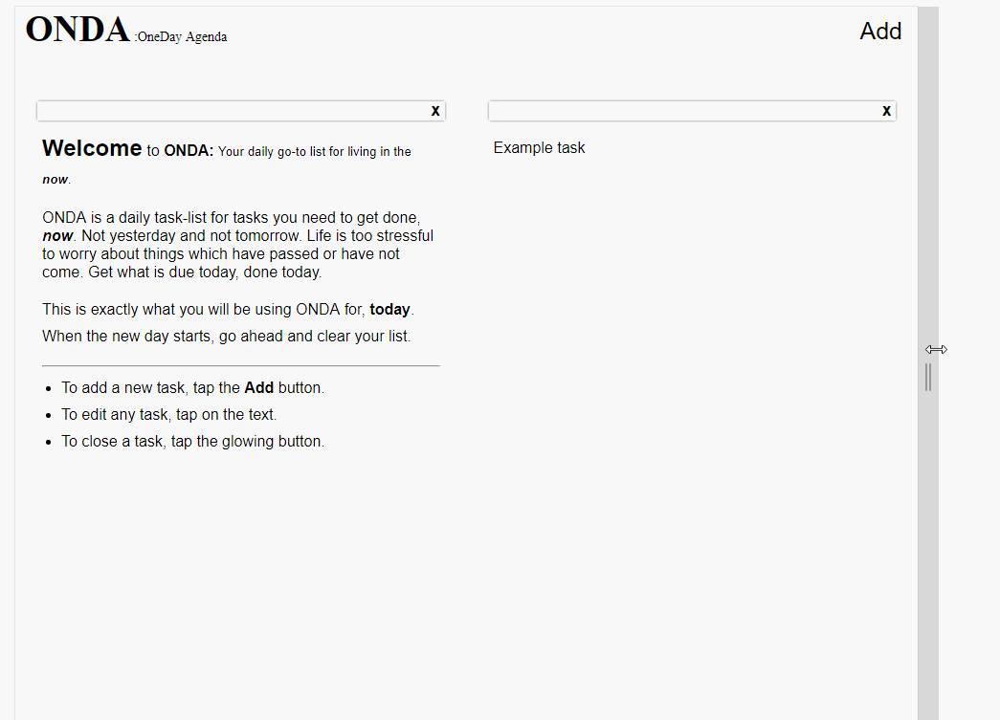

# Onda

A small todo-list app made for focusing on the now. 

# See it in action:

Live url: https://making.codes/app/ghub/onda/

# Quick info
This is a part of a collection of older applications I've done.

This was a simple application made using vanillaJS and CSS. I also used a css
animation library which was used for the entrance, addition, and deletion
of tasks.

This application utilizes a basic structure.

# General Application Flow
The application relies on JavaScript for loading your application from the cache,
and for saving tasks as you add and write to them. Event listeners exist
for each delete button and are removed when deleted. 

There are also event listeners for when animations end to remove the css animations.

The containers are split between a "right list" and a "left list" and are sorted 
based on the height of each one. When right or left becomes greater than the other,
new nodes get added to the shorter one. When an element is removed, there is an update
which calls the sorting algorithm and updates the positions of the tasks to even out.

There is an event listener which waits for size changes so that when it grows too
large or too small the tasks merge into one list (the left list) or split between
the two existing lists evenly.

The opening of the application first attempts to load from the local storage. If there
is any storage it will use the existing tasks, otherwise, it will start you off with
an introductory task by making the node visible to the user.

# How to run
1. clone it into a folder of your choice `git clone https://github.com/Im-Andrew/VanillaJS-Task-List.git`
2. Open the index.html file via your browser and your live!

# [Contact me](https://www.making.codes/#contact-me)
I am available for hire. You can quickly get in contact with me here:
[making.codes/#contact-me](https://www.making.codes/#contact-me)
